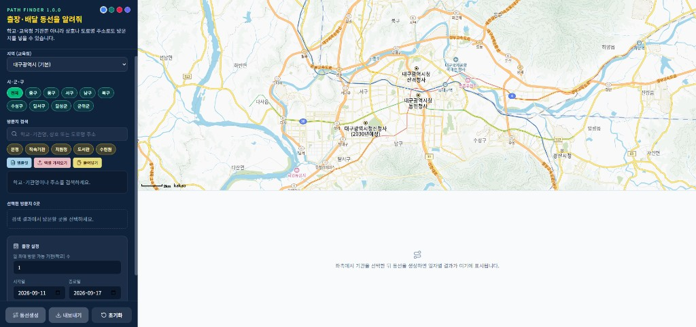
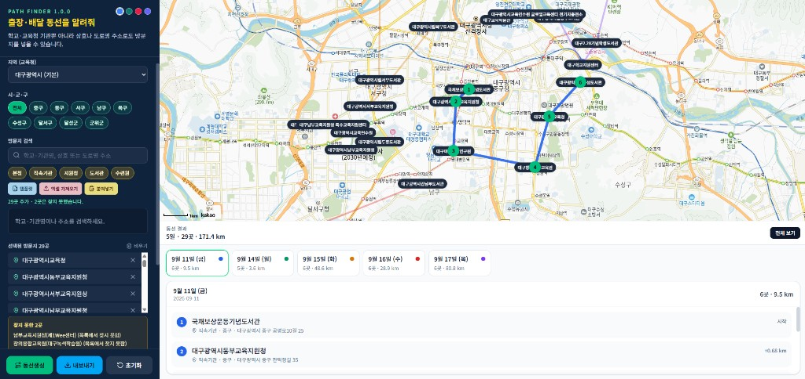

# Path Finder 1.0.0

학교·기관 주소 기반 **배달/출장 동선 최적화** 웹 앱입니다.

**Production:** [https://pathfinder-eight-pearl.vercel.app/](https://pathfinder-eight-pearl.vercel.app/)

**저장소:** [GitHub](https://github.com/soonpyopark/Path-Finder) · [GitLab](https://gitlab.aigov.go.kr/soonpyo/pathfinder)

기본 지역은 **대구광역시**이며, 좌측 패널의 교육청 선택으로 전국에서 사용할 수 있습니다. 검색은 내장 더미 데이터와 나이스 개방 포털 API를 함께 쓰고, 선택된 방문지를 일자별로 나눠 카카오맵에 표시합니다.

## 실행 화면

시작 화면입니다. 왼쪽에서 지역·방문지를 고르고, 오른쪽 카카오맵에서 위치를 확인합니다.



동선을 생성한 화면입니다. 지도에 일자별 경로가 그려지고, 아래에 방문 순서가 카드로 나옵니다.



## 로컬에서 실행하기

처음 한 번은 의존성을 설치합니다.

```bash
npm install
```

카카오맵·나이스 키를 쓰려면 환경 변수 파일을 만듭니다. 키가 없어도 더미 데이터로 검색과 동선 생성은 동작합니다.

```bash
copy .env.example .env.local
```

`.env.local` 예시는 아래와 같습니다.

```
NEXT_PUBLIC_KAKAO_MAP_KEY=
NEXT_PUBLIC_NEIS_API_KEY=
```

개발 서버는 다음 명령으로 실행합니다.

```bash
npm run dev
```

브라우저에서 [http://localhost:3000](http://localhost:3000) 을 엽니다.

이미 `npm run dev`가 켜져 있거나 `.next` 캐시 때문에 이상하게 보일 때는 포트 3000 프로세스를 종료하고 캐시를 지운 뒤 다시 시작합니다.

```bash
npm run dev:restart
```

| 명령 | 역할 |
| --- | --- |
| `npm run dev` | Next.js 개발 서버 시작 (기본 `http://localhost:3000`) |
| `npm run dev:restart` | 3000 포트 점유 프로세스 종료 → `.next` 삭제 → `npm run dev` 재시작 |
| `npm run build` | 프로덕션 빌드 |
| `npm run start` | 빌드된 앱 실행 |
| `npm run lint` | ESLint 검사 |

Windows PowerShell에서도 위 npm 스크립트를 그대로 사용하면 됩니다.

## 주요 기능

- 교육청 단위 지역 선택 (기본값: 대구광역시, 2026년 7월 전남·광주 통합교육청 반영)
- 학교/기관 검색 및 선택 (더미 데이터 + 나이스 API)
- 일 방문 기관(학교) 수, 출장 기간, 주말 포함/제외
- 최근접 이웃 방식으로 일자별 동선 생성
- 카카오맵 표시 및 일자별 동선 카드

## 환경 변수

| 변수 | 설명 |
| --- | --- |
| `NEXT_PUBLIC_KAKAO_MAP_KEY` | 카카오 개발자 콘솔 JavaScript 키 |
| `NEXT_PUBLIC_NEIS_API_KEY` | 나이스 교육정보 개방 포털 API 키 |

카카오 개발자 콘솔 **플랫폼 키 → JavaScript 키 → JavaScript SDK 도메인**에 아래 주소를 등록해야 지도가 표시됩니다.

- `http://localhost:3000`
- `https://pathfinder-eight-pearl.vercel.app`

## Vercel 배포

Production URL: [https://pathfinder-eight-pearl.vercel.app/](https://pathfinder-eight-pearl.vercel.app/)

1. GitHub 저장소를 Vercel에 연결합니다.
2. Environment Variables에 위 두 키를 넣습니다. (`NEXT_PUBLIC_*`는 빌드 시점에 들어가므로 키를 넣은 뒤 다시 배포합니다.)
3. 카카오 콘솔 JavaScript SDK 도메인에 Production URL을 등록합니다. Preview URL(`…-xxxx.vercel.app`)은 배포마다 바뀌므로 카카오에 넣어도 다음 배포부터는 다시 막힙니다.

## 라이선스

소스 코드는 [MIT License](./LICENSE)입니다. 카카오맵과 나이스 API는 각 서비스 이용약관의 적용을 받습니다.
